# __North American nectar sources of honey bees: <br> A data wrangling & EDA project__

### Honey bees play a vital role in North American agriculture, many of the fruits and vegetables in our grocery stores are a direct result of the efforts of these industrious pollinators.  Their honey is also an important part of the economy, in 2019 honey bees in the United States produced 157 million lbs of honey worth an estimated value of over \$339 million¹.   An interesting subset of the honey market is monofloral honey; this is honey that is produced primarily from the nectar of one type of plant.  Monofloral honey is difficult/costly to produce and it sold at premium price in the marketplace. Wikipedia has an article with two lists of North American nectar sources for honey bees.  This project copies the data from wikipedia and produces one cleaned/wrangled dataset.   An exploratory data analysis (EDA) of the dataset is provided and an emphasis on patterns involving monofloral honey 

#### The data for the project originated from a wikipedia article on __[North American nectar sources for honey bees](https://en.wikipedia.org/wiki/List_of_Northern_American_nectar_sources_for_honey_bees)__.  Two table from the article were extracted and required wrangling to create a dataset that would lend itself to a more in depth analysis with python.

[1] Center for Veterinary Medicine. “Helping Agriculture’s Helpful Honey Bees.” U.S. Food and Drug Administration, 2019, www.fda.gov/animal-veterinary/animal-health-literacy/helping-agricultures-helpful-honey-bees.

***
### Import the libraries to extract the tables and load into pandas


```python
import requests
from bs4 import BeautifulSoup
import pandas as pd

page = requests.get(
    "https://en.wikipedia.org/wiki/List_of_Northern_American_nectar_sources_for_honey_bees")
soup = BeautifulSoup(page.content, 'html.parser')

table = soup.find_all('table')
df_raw_1 = pd.read_html(str(table))[0]
df_raw_2 = pd.read_html(str(table))[1]
```

## __Data cleaning/wrangling__
#### The first 3 lines of each table:


```python
df_raw_1.head(3)
```


<div>
<style scoped>
    .dataframe tbody tr th:only-of-type {
        vertical-align: middle;
    }

    .dataframe tbody tr th {
        vertical-align: top;
    }

    .dataframe thead th {
        text-align: right;
    }
</style>
<table border="1" class="dataframe">
  <thead>
    <tr style="text-align: right;">
      <th></th>
      <th>Plant type</th>
      <th>Nonscientific name</th>
      <th>Scientific name</th>
      <th>Begin Bloom Month</th>
      <th>End Bloom Month</th>
      <th>Monofloral honey</th>
      <th>Availability</th>
      <th>Source for honey bees / pounds of honey per acre</th>
    </tr>
  </thead>
  <tbody>
    <tr>
      <th>0</th>
      <td>T</td>
      <td>Maple[2]</td>
      <td>Acer</td>
      <td>1</td>
      <td>5</td>
      <td>no</td>
      <td>feral</td>
      <td>major but temperature usually too cold</td>
    </tr>
    <tr>
      <th>1</th>
      <td>T</td>
      <td>Red maple[2]</td>
      <td>Acer rubrum</td>
      <td>1</td>
      <td>5</td>
      <td>no</td>
      <td>feral</td>
      <td>major but temperature usually too cold for bee...</td>
    </tr>
    <tr>
      <th>2</th>
      <td>T</td>
      <td>Ohio buckeye[3]</td>
      <td>Aesculus glabra</td>
      <td>4</td>
      <td>5</td>
      <td>no</td>
      <td>feral</td>
      <td>minor</td>
    </tr>
  </tbody>
</table>
</div>


```python
df_raw_2.head(3)
```


<div>
<style scoped>
    .dataframe tbody tr th:only-of-type {
        vertical-align: middle;
    }

    .dataframe tbody tr th {
        vertical-align: top;
    }

    .dataframe thead th {
        text-align: right;
    }
</style>
<table border="1" class="dataframe">
  <thead>
    <tr style="text-align: right;">
      <th></th>
      <th>Plant type</th>
      <th>Common name</th>
      <th>Latin name</th>
      <th>Perennial/annual</th>
      <th>Begin bloom month</th>
      <th>End bloom month</th>
      <th>Monofloral honey</th>
      <th>Availability</th>
      <th>Nectar production</th>
    </tr>
  </thead>
  <tbody>
    <tr>
      <th>0</th>
      <td>F</td>
      <td>Anise hyssop[4]</td>
      <td>Agastache foeniculum</td>
      <td>Perennial</td>
      <td>7.0</td>
      <td>10.0</td>
      <td>no</td>
      <td>feral</td>
      <td>minor (1858-2787kg/ha)[6]</td>
    </tr>
    <tr>
      <th>1</th>
      <td>F</td>
      <td>Blue bugle, bugleherb, bugleweed, carpetweed, ...</td>
      <td>Ajuga reptans</td>
      <td>Perennial</td>
      <td>5.0</td>
      <td>6.0</td>
      <td>NaN</td>
      <td>feral</td>
      <td>minor</td>
    </tr>
    <tr>
      <th>2</th>
      <td>F</td>
      <td>Chives[4]</td>
      <td>Allium schoenoprasum</td>
      <td>Perennial</td>
      <td>5.0</td>
      <td>9.0</td>
      <td>no</td>
      <td>cultivated</td>
      <td>minor</td>
    </tr>
  </tbody>
</table>
</div>


### There are a few issues that stand out:
    - The column headers do not use identical naming conventions.  
    - The column headers are strings with spaces between the words.
    - The second table has 9 columns than while the first table has 8 columns.
    - The nonscientific/common name column has numbers encapsulated in brackets.  This is an artifact from links to citations in the wikipedia article.
    - The common names also have more than one name in a comma separated format which may not be visually appealing in plots.
    - The final column in each table is used to indicated if a nectar source is major or minor.  Some of the entries have additional text that will need to be removed. 
### The first order of business is to restructure the two tables and combine them into a dataframe.


```python
df = df_raw_1.copy()

# The first table is missing this column. Further research revealed that all of the plants are perennials.
df['life_cycle'] = 'perennial'

# The new life_cycle col needs to be in the 4th position before the 2nd table is appended. 
df = df[df.columns[[0,1,2,8,3,4,5,6,7]]]

# Replace spaces in column names with underscores and converted to lowercase
df_cols = list(df.columns)
df_cols = [x.lower() for x in df_cols]
converter = lambda x: x.replace(' ', '_')
df_cols = list(map(converter,df_cols))

# The last column is too wordy, renamed to 'source'
df_cols.pop(-1)
df_cols.append('source')

# Changed name of column to make it less confusing and appended the 2nd table
df.columns = df_cols
df_raw_2.columns = df_cols
df = df.append(df_raw_2, ignore_index=True)
df.rename(columns={'nonscientific_name':'common_name'}, 
         inplace=True)
```

### Now that the data has been consolidated, are there any missing or inconsistent values?   


```python
df.info()
```

    <class 'pandas.core.frame.DataFrame'>
    RangeIndex: 109 entries, 0 to 108
    Data columns (total 9 columns):
     #   Column             Non-Null Count  Dtype  
    ---  ------             --------------  -----  
     0   plant_type         109 non-null    object 
     1   common_name        109 non-null    object 
     2   scientific_name    107 non-null    object 
     3   life_cycle         109 non-null    object 
     4   begin_bloom_month  98 non-null     float64
     5   end_bloom_month    97 non-null     float64
     6   monofloral_honey   91 non-null     object 
     7   availability       100 non-null    object 
     8   source             102 non-null    object 
    dtypes: float64(2), object(7)
    memory usage: 7.8+ KB


### There are 109 rows, however, several of the features have less than 109 rows.  This indicates the presence of null values.


```python
print('Count of null values')
df.isnull().sum()
```

    Count of null values


    plant_type            0
    common_name           0
    scientific_name       2
    life_cycle            0
    begin_bloom_month    11
    end_bloom_month      12
    monofloral_honey     18
    availability          9
    source                7
    dtype: int64


### The information for the missing values will need to be researched manually added.

### A detailed breakdown of the categorical feature values.


```python
print('Count of unique values')
df.nunique()
```

    Count of unique values


    plant_type             7
    common_name          109
    scientific_name      106
    life_cycle             6
    begin_bloom_month      9
    end_bloom_month        7
    monofloral_honey      24
    availability          16
    source                34
    dtype: int64


```python
df['plant_type'].value_counts().plot.barh()
```


    <AxesSubplot:>


    
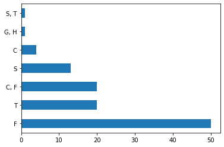
    


### The feature values are single characters, this is confusing without a legend to reference.  Replacing the characters with the words they represent will add clarity.  Also, the comma separated values will need to be researched to determine if the values warrant their own category. 


```python
df['life_cycle'].value_counts().plot.barh()
```


    <AxesSubplot:>


    
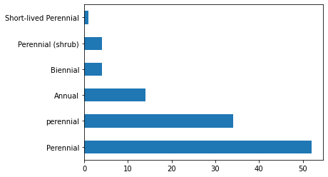
    


### There are 4 different values for perennial, these all need to be consolidated into one value named perennial.


```python
df['monofloral_honey'].value_counts()
```


    no                                                                                                    59
    yes                                                                                                    6
    can be                                                                                                 3
    as clover honey                                                                                        3
    no; honey is pale yellow or amber with strong flavor[3]                                                1
    no?                                                                                                    1
    no, honey is clear, heavy bodied, of excellent flavor[3]                                               1
    light honey of good quality[3]                                                                         1
    can be, honey golden color of deep amber; marked flavor; granulates quickly                            1
    No, the nectar is mostly used for spring brood-raising and not stored for surplus.[5]                  1
    no, honey deep yellow, granulates quickly; mostly consumed by bees during brood rearing[5]             1
    as clover honey; honey is white or nearly white; very mild flavored and does not granulate readily     1
    yes, see Monofloral honey                                                                              1
    no??                                                                                                   1
    as clover honey, alfalfa honey granulates readily[3]                                                   1
    mixed with other honeys                                                                                1
    see Monofloral honey                                                                                   1
    usually mixed with goldenrod[3]                                                                        1
    yes[3]                                                                                                 1
    can be, dark honey with distinct flavor, granulates quickly                                            1
    no, honey amber and of good flavor                                                                     1
    as clover honey, alsike clover honey is one of the best honey plants in America.[3]                    1
    yes, short flow up to 14 days; white, aromatic honey[3] see Monofloral honey                           1
    Honey is light in color and mild in flavor.                                                            1
    Name: monofloral_honey, dtype: int64


```python
df['availability'].value_counts()
```


    feral                                                                                                                                                                                                                                                                                       48
    feral, cultivated                                                                                                                                                                                                                                                                           15
    cultivated                                                                                                                                                                                                                                                                                  14
    ornamental                                                                                                                                                                                                                                                                                   6
    feral, ornamental                                                                                                                                                                                                                                                                            6
    feral?                                                                                                                                                                                                                                                                                       1
    Western US – Prolonged bloom of 45 – 50 days generally in summer, but with repeat blooming in California. Delicate honey with very light, pinkish color.                                                                                                                                     1
    ornamental?                                                                                                                                                                                                                                                                                  1
    Western US – One of the best spring forage sources for honeybees. Blooms 45–60 days and continuously produces nectar throughout the day. Can be seeded several times per year. Prefers 3 ft of topsoil.                                                                                      1
    cultivated?                                                                                                                                                                                                                                                                                  1
    feral, ornamental, produces a high volume of honey on a cycle of every five to eight years, with lower volume of nectar other years[citation needed]                                                                                                                                         1
    cultivated, ornamental                                                                                                                                                                                                                                                                       1
    rarely cultivated now                                                                                                                                                                                                                                                                        1
    feral, all species are great for honeybees, nectar is so abundant that shaking the blossoms allows visible nectar fall                                                                                                                                                                       1
    feral (invasive in North America)                                                                                                                                                                                                                                                            1
    feral In California, spring-blooming plant with repeat bloom, fall bloom provides nectar for bees for overwintering. The most unusual feature of E. vulgare is the protection of the nectar inside the flower from vaporization (when weather is hot) or flushing away (when rains). [7]     1
    Name: availability, dtype: int64


```python
df['source'].value_counts()
```


    minor                                                                                                                   54
    major                                                                                                                   14
    major up to 200 lb per hive                                                                                              2
    major but temperature usually too cold for bees to fly                                                                   2
    minor (1858-2787kg/ha)[6]                                                                                                1
    major in some areas                                                                                                      1
    minor – 30 kg/ha                                                                                                         1
    minor, strong hives can collect up to 100 lb[3]                                                                          1
    major – up to 500 lb/acre in a good year[3]                                                                              1
    major[4]                                                                                                                 1
    major but temperature usually too cold                                                                                   1
    [8]                                                                                                                      1
    major in some areas[4]                                                                                                   1
    minor – 20–30 lb/acre                                                                                                    1
    major – 800–1,100 lb/acre                                                                                                1
    major, but outside temperatures are usually too cold for bees to fly, 100–150 lb/acre; 1,500 lb pollen                   1
    major – 300–1,000 lb/acre honey depending on soil, 500–2000 lb of dark blue pollen                                       1
    150–250 lb/acre honey, 50–120 lb pollen                                                                                  1
    minor – 50–150 lb/acre honey                                                                                             1
    minor in most areas, very low quality pollen, strong colonies may store 50–90 lb of surplus from it[3]                   1
    180–1,500 pounds honey per acre, depending on soil quality and depth; 300–1000 pounds of pollen.[7]                      1
    minor, can be major under the correct conditions/location                                                                1
    major[3]                                                                                                                 1
    100–200 lb honey                                                                                                         1
    minor, but can be major on cultivated area, 200 lb/acre honey, 60–160 lb pollen                                          1
    minor – 30–100 pounds/acre                                                                                               1
    major, up to 500 lb/acre[4]                                                                                              1
    minor, or major depending on location and weather.                                                                       1
    major – 120–250 lb/acre, depending on soil and if good fertilization, Asclepias syriaca has the highest honey yield.     1
    major – 800–1200 lb/acre; short bloom period of about 10 days                                                            1
    minor, but valuable due to earliness/frost hardiness                                                                     1
    minor – 50–100 lb/acre                                                                                                   1
    major in southern Appalachians, select northern locations, and Piedmont                                                  1
    minor, important in Southeastern US                                                                                      1
    Name: source, dtype: int64


### These 3 features have several rows with lengthy descriptive wording that needs to be removed.  The availability feature essentially has 3 categorical responses; feral, cultivated and ornamental.  The distinction between cultivated and ornamental is not important for this project; plants in both environments are managed completely by humans.  Research of the responses identified as feral indicated that the provided labels were misleading, there were both native wild and feral species in the listing.  In the context of this study, the environment of the plant's habitat (wild) seemed like a better descriptor.


```python
# manually add some missing data
df.at[54,'scientific_name']='Cucumis sativus'
df.at[55, 'scientific_name']='Cucumis melon'
df.at[55, 'common_name']='honeydew melon'

# this function simplfies some of the manual data entry that was needed
def set_bloom(index, begin, end):
    df.at[index,'begin_bloom_month']=begin
    df.at[index, 'end_bloom_month']=end
    
#source https://ucjeps.berkeley.edu/eflora/search_eflora.php
set_bloom(0,3,6)
#source https://www.uky.edu/hort/Red-Maple
set_bloom(1,3,4)
#source: https://dnr.wisconsin.gov/topic/Invasives/fact/CanadaThistle.html
set_bloom(48,6,9)
#source: https://plants.jstor.org/compilation/Erica.vulgaris
set_bloom(63,5,9)
#source (pg128): https://digitalcommons.unl.edu/cgi/viewcontent.cgi?article=1151&context=tnas
set_bloom(66,7,10)
#source https://plants.ces.ncsu.edu/plants/ocimum-basilicum/
set_bloom(69, 6, 8)
#source https://ucjeps.berkeley.edu/eflora/eflora_display.php?tid=33161
set_bloom(77, 6, 9)
#source https://ucjeps.berkeley.edu/eflora/eflora_display.php?tid=33203
set_bloom(78, 7, 9)
#source https://ucjeps.berkeley.edu/eflora/eflora_display.php?tid=36229
set_bloom(81, 6, 8)
#source https://ucjeps.berkeley.edu/eflora/eflora_display.php?tid=37579
set_bloom(82, 3, 5)
#source https://ucjeps.berkeley.edu/eflora/eflora_display.php?tid=38570
set_bloom(83, 4, 9)
#source https://plants.ces.ncsu.edu/plants/hylotelephium-spectabile/
set_bloom(91, 6, 11)
#source https://ucjeps.berkeley.edu/eflora/eflora_display.php?tid=47098
set_bloom(99, 5, 9)
#source https://ucjeps.berkeley.edu/eflora/eflora_display.php?tid=47100
set_bloom(100, 5, 8)

# to validate the missing monofloral honey data, I queried a search engine for the common name + honey + north america
# honeysuckle honey is produced in italy and the other varieties produced zero results, all were marked as False
df['monofloral_honey'].fillna('no', inplace=True)

df['availability'].fillna('wild', inplace=True)

#the 2 rows with missing source values appear to both be minor after looking them up in a search engine
df['source'].fillna('minor', inplace=True)

#make all string datatypes lowercase
df = df.applymap(lambda s:s.lower() if type(s) == str else s)

df.loc[(df['plant_type'] == 't'), ('plant_type')] = 'tree'
df.loc[(df['plant_type'] == 'g, h'), ('plant_type')] = 'tree' #data entry errror, plantain tree were entered in the wiki as grass/herb
df.loc[(df['plant_type'] == 's'), ('plant_type')] = 'shrub'
df.loc[(df['plant_type'] == 's, t'), ('plant_type')] = 'shrub'
df.loc[(df['plant_type'] == 'c'), ('plant_type')] = 'crop'
df.loc[(df['plant_type'] == 'c, f'), ('plant_type')] = 'crop'
df.loc[(df['plant_type'] == 'f'), ('plant_type')] = 'flower'

#remove wiki citations from the columns
citation_pattern = r"[\[\d\]]"
df.replace(citation_pattern,'',regex=True, inplace=True)

#removed multiple entries/long descriptions preceded by a comma or semicolon
#also included a few residual patterns of unneeded data that were discovered 
comma_pattern = r',.+|;.+|echium vulgare is most widely known|and\s.+|\(.+\)'
df.replace(comma_pattern,'',regex=True, inplace=True)
list(df['scientific_name'])

#row 108 is a duplicate, the black haw plant is listed twice
df.drop(108, inplace=True)

#standardize values in life_cycle column 
peren_pattern_1 = r'perennial\s'
peren_pattern_2 = r'short'
df.loc[(df['life_cycle'].str.match(peren_pattern_1)==True),('life_cycle')]='perennial'
df.loc[(df['life_cycle'].str.match(peren_pattern_2)==True),('life_cycle')]='perennial'

#standardize monofloral_honey column
df.loc[(df['monofloral_honey'].str.match('no[?|\s]')==True), ('monofloral_honey')]='no'

#I researched these matches to determine if monofloral honey is produced
honey_yes_pattern = r'as clover honey|can be|light honey|mixed|see|usually|honey is'
df.loc[(df['monofloral_honey'].str.match(honey_yes_pattern)==True), ('monofloral_honey')]='yes'

#standardize the availability column
cul_pattern = r'cultivated(.+)?|ornamental(.+)?|rarely|western'
wild_pattern = r'feral(.+)?'
df.loc[df['availability'].str.match(cul_pattern),'availability'] = 'cultivated'
df.loc[df['availability'].str.match(wild_pattern),'availability'] = 'wild'

#standardize the source column
maj_pattern = r'major(.+)?'
min_pattern = r'minor(.+)?'
df.loc[df['source'].str.match(maj_pattern), 'source'] = 'major'
df.loc[df['source'].str.match(min_pattern), 'source'] = 'minor'
df.loc[(df['source'] != 'minor') & (df['source'] != 'major'),'source'] = 'major'
```


```python
print('Count of null values')
df.isnull().sum()
```

    Count of null values


    plant_type           0
    common_name          0
    scientific_name      0
    life_cycle           0
    begin_bloom_month    0
    end_bloom_month      0
    monofloral_honey     0
    availability         0
    source               0
    dtype: int64


```python
print('Count of unique values')
df.nunique()
```

    Count of unique values


    plant_type             4
    common_name          108
    scientific_name      108
    life_cycle             3
    begin_bloom_month      8
    end_bloom_month        8
    monofloral_honey       2
    availability           2
    source                 2
    dtype: int64


### It took a bit of research to fill in the null values and a bit of regex magic to clear up the data inconsistencies. Now the next stage in the process may begin.
# __Exploratory Data Analysis__


```python
import seaborn as sns
import matplotlib.pyplot as plt
df.info()
```

    <class 'pandas.core.frame.DataFrame'>
    Int64Index: 108 entries, 0 to 107
    Data columns (total 9 columns):
     #   Column             Non-Null Count  Dtype  
    ---  ------             --------------  -----  
     0   plant_type         108 non-null    object 
     1   common_name        108 non-null    object 
     2   scientific_name    108 non-null    object 
     3   life_cycle         108 non-null    object 
     4   begin_bloom_month  108 non-null    float64
     5   end_bloom_month    108 non-null    float64
     6   monofloral_honey   108 non-null    object 
     7   availability       108 non-null    object 
     8   source             108 non-null    object 
    dtypes: float64(2), object(7)
    memory usage: 8.4+ KB


### There are 7 qualitative features in this dataset and 2 quantitative features. The quantitative features are ordinal variables that represent the start/stop months of each plant's blooming cycle.  The qualitative features are nominal variables; common_name and scientific_name both have a unique entry for each row while the other variables have 2-4 possible values.


```python
df.describe()
```


<div>
<style scoped>
    .dataframe tbody tr th:only-of-type {
        vertical-align: middle;
    }

    .dataframe tbody tr th {
        vertical-align: top;
    }

    .dataframe thead th {
        text-align: right;
    }
</style>
<table border="1" class="dataframe">
  <thead>
    <tr style="text-align: right;">
      <th></th>
      <th>begin_bloom_month</th>
      <th>end_bloom_month</th>
    </tr>
  </thead>
  <tbody>
    <tr>
      <th>count</th>
      <td>108.000000</td>
      <td>108.000000</td>
    </tr>
    <tr>
      <th>mean</th>
      <td>5.629630</td>
      <td>7.305556</td>
    </tr>
    <tr>
      <th>std</th>
      <td>1.469901</td>
      <td>1.784975</td>
    </tr>
    <tr>
      <th>min</th>
      <td>2.000000</td>
      <td>4.000000</td>
    </tr>
    <tr>
      <th>25%</th>
      <td>5.000000</td>
      <td>6.000000</td>
    </tr>
    <tr>
      <th>50%</th>
      <td>6.000000</td>
      <td>8.000000</td>
    </tr>
    <tr>
      <th>75%</th>
      <td>7.000000</td>
      <td>9.000000</td>
    </tr>
    <tr>
      <th>max</th>
      <td>9.000000</td>
      <td>11.000000</td>
    </tr>
  </tbody>
</table>
</div>


```python
num_vars = ['begin_bloom_month', 'end_bloom_month']
cat_vars = ['plant_type', 'life_cycle', 'monofloral_honey', 'availability', 'source']
fig,axes=plt.subplots(1,2,figsize=(25, 6))
sns.despine()
for i in num_vars:
    sns.kdeplot(x=i, 
                data=df,
                color='#f4811d',
                fill=True,
                ax=axes[int(num_vars.index(i))]
                )
```


    
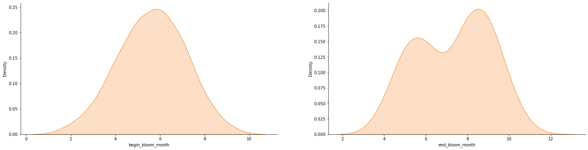
    


```python
fig,axes=plt.subplots(1,2,figsize=(25, 6))
sns.despine()
for i in num_vars:
    sns.boxplot(x=i, 
                data=df,
                palette='YlOrBr', 
                ax=axes[int(num_vars.index(i))]
                )
```


    
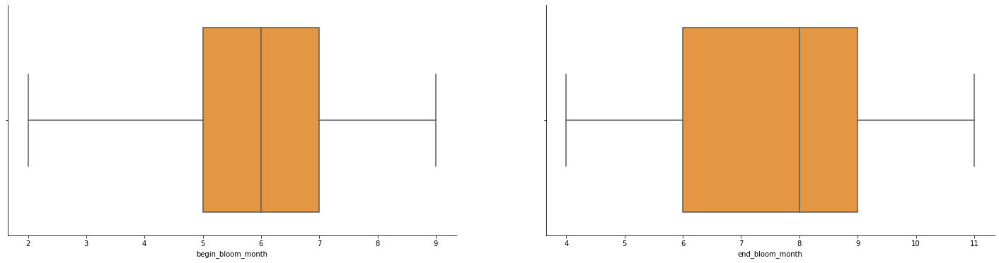
    


## Univariate analysis - quantitative features
### The begin_bloom_month feature has a median month of June and it is a unimodal normal distribution with a fairly compact IQR spanning from May-July.  The end_bloom_month feature has a median month of August. It is a bimodal with peaks in late Spring and September; the distribution's IQR covers May-September.  Outliers are not present in either distribution.  It is also worth noting that some of the end_bloom_month values occur in early spring.  This could be a data entry error and should be researched further.    


```python
fig,axes=plt.subplots(1,5,figsize=(25, 6))
sns.despine()
for i in cat_vars:
    sns.countplot(x=i, 
                  data=df, 
                  palette='YlOrBr', 
                  order=df[i].value_counts().index,
                  ax=axes[int(cat_vars.index(i))]
                 )
```


    

    


```python
fig,axes=plt.subplots(1,5,figsize=(25, 6))
sns.despine()
for i in cat_vars:
    sns.boxplot(x=df[i].value_counts(), 
                data=df,
                palette='YlOrBr', 
                ax=axes[int(cat_vars.index(i))]
                )
```


    
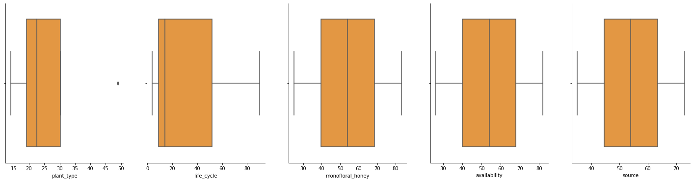
    


## Univariate analysis - qualitative features
### The bar charts of each categorical feature give a better sense of the distribution of each response.  It is interesting to note that each feature has one response that accounts for 50% or more of all responses.   The boxplots indicate that there are outliers in the plant_type feature.  The spread of both the plant_type and life_cycle features are unusual as well.  This is probably due to the skewness towards one response affecting the mean.  


```python
def cat_charts(hue_value):
    cat_chart_vars = ['plant_type', 'life_cycle', 'monofloral_honey', 'availability', 'source']
    fig,axes=plt.subplots(1,5,figsize=(25, 6))
    sns.despine()
    
    for i in cat_chart_vars:
        if i == hue_value:
            pass
        else:
            sns.countplot(x=i, 
                          data=df, 
                          palette='YlOrBr',
                          hue=hue_value,
                          order=df[i].value_counts().index,
                          ax=axes[int(cat_vars.index(i))]
                         ).legend(loc='upper right',title=hue_value)
            
            
    #plt.legend(loc='upper right')
for x in cat_vars:
    cat_charts(x)
```


    
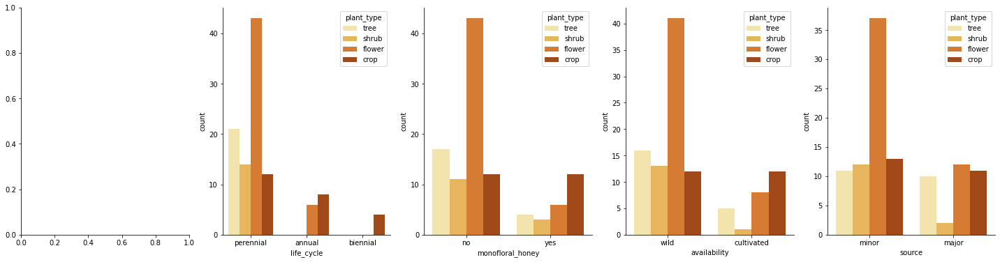
    


    
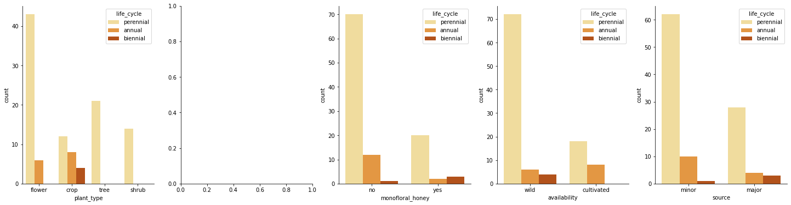
    


    
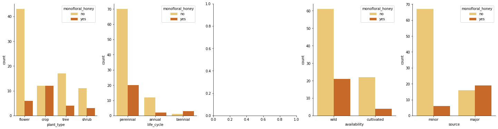
    


    
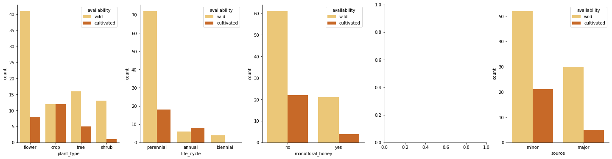
    


    
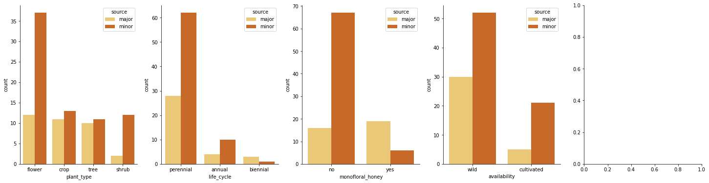
    


### By segmenting pairs of categorical features, a few interesting observations were made:
#### * Perennial flowers and trees account for roughly 75% of the nectar producing plants.  <br> * Most monofloral honey is derived from the nectar of perennial plants. <br> * Crop plants are the leading source of monofloral honey, accounting for nearly 50% total sources.

*Curiously noted that around half of the crop plants were identified as wild.  These plants may need to be classified as feral or there may be underlying data integrity issues from wikipedia's article.*

### __Are there any unique patterns associated with the monofloral nectar sources?__ <br> 


```python
df['bloom_delta'] = df['end_bloom_month'] - df['begin_bloom_month']

df_mono = df[df['monofloral_honey']=='yes']

fig,axes=plt.subplots(figsize=(13, 8))
sns.despine()
sns.stripplot(data=df_mono, 
              x='begin_bloom_month',
              y='end_bloom_month',
              hue='monofloral_honey',
              marker='h',
              jitter=.5,
              size=11,
              palette='YlOrBr'
             )
```


    <AxesSubplot:xlabel='begin_bloom_month', ylabel='end_bloom_month'>


    
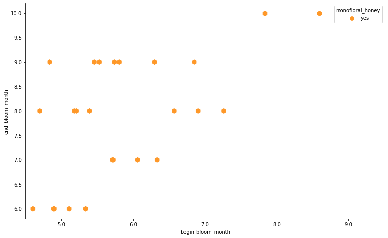
    


### This plot illustrates the relationship between begin and end bloom months of each species of plant used for monofloral honey.  There are a few interesting observations worth noting:
#### - There are plants that start to bloom in April and end in September, providing a 5 month window of opportunity.<br>- There are clusters of plants that have similar start/end times.  This could prove useful for planning hive relocation strategies during the season and selecting crops to cultivate.<br>- There are also clusters of plants that bloom for 1 month.  These plants should be researched further, it may be a biological fact that the plants have a short bloom cycle but it is also possible that the data was incorrectly entered into wikipedia.*


```python
months_numbers = [1,2,3,4,5.0,6,7,8,9,10,11,12]
months_verbose = ['Jan', 'Feb', 'Mar', 'Apr', 'May', 'Jun', 'Jul', 'Aug', 'Sep', 'Oct', 'Nov', 'Dec']
fig,axes=plt.subplots(1,3, figsize=(16, 8))
sns.despine()
ax0 = sns.countplot(y='begin_bloom_month', 
              data=df_mono,
              palette='YlOrBr',
              hue='plant_type',
              ax=axes[0]
             )
ax0.set_title('Begin bloom month')
ax0.set(ylabel=None)
ax0.set_yticklabels(['May','Jun','Jul','Aug','Sep'])
ax0.legend(loc='lower right',title='Plant type')

ax1 = sns.countplot(y='end_bloom_month', 
              data=df_mono,
              palette='YlOrBr',
              hue='plant_type',
              ax=axes[1]
             )
ax1.set_title('End bloom month')
ax1.set_yticklabels(['Jun','Jul','Aug','Sep','Oct'])
ax1.set(ylabel=None)
ax1.legend(loc='lower right',title='Plant type')

ax2 = sns.countplot(y='bloom_delta', 
              data=df_mono,
              palette='YlOrBr',
              hue='plant_type',
              ax=axes[2]
             )
ax2.set_title('Bloom cycle duration')
ax2.legend(loc='lower right',title='Plant type')
ax2.set(ylabel='Consecutive months')
```


    [Text(0, 0.5, 'Consecutive months')]


    
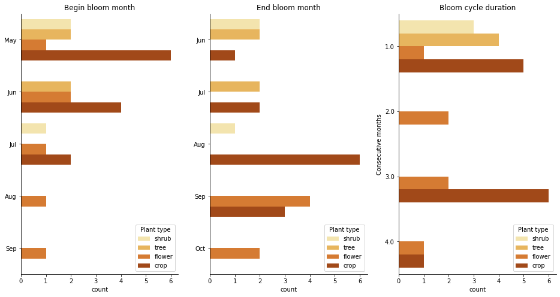
    


### The bar charts breakdown the plant type for each monofloral honey nectar source.  Observations of interest:  
#### - Most of the plants begin blooming in May/June and end in Aug/Sep.<br>- Crops have a peak bloom cycle of 3 months, while shrubs and trees peak in 1 month. 


```python
df_mono.sort_values(by=['begin_bloom_month','end_bloom_month', 'common_name'])
```


<div>
<style scoped>
    .dataframe tbody tr th:only-of-type {
        vertical-align: middle;
    }

    .dataframe tbody tr th {
        vertical-align: top;
    }

    .dataframe thead th {
        text-align: right;
    }
</style>
<table border="1" class="dataframe">
  <thead>
    <tr style="text-align: right;">
      <th></th>
      <th>plant_type</th>
      <th>common_name</th>
      <th>scientific_name</th>
      <th>life_cycle</th>
      <th>begin_bloom_month</th>
      <th>end_bloom_month</th>
      <th>monofloral_honey</th>
      <th>availability</th>
      <th>source</th>
      <th>bloom_delta</th>
    </tr>
  </thead>
  <tbody>
    <tr>
      <th>23</th>
      <td>tree</td>
      <td>black locust</td>
      <td>robinia pseudoacacia</td>
      <td>perennial</td>
      <td>5.0</td>
      <td>6.0</td>
      <td>yes</td>
      <td>wild</td>
      <td>major</td>
      <td>1.0</td>
    </tr>
    <tr>
      <th>25</th>
      <td>shrub</td>
      <td>blackberry</td>
      <td>rubus spp.</td>
      <td>perennial</td>
      <td>5.0</td>
      <td>6.0</td>
      <td>yes</td>
      <td>wild</td>
      <td>major</td>
      <td>1.0</td>
    </tr>
    <tr>
      <th>46</th>
      <td>crop</td>
      <td>oil rapeseed</td>
      <td>brassica napus l.</td>
      <td>annual</td>
      <td>5.0</td>
      <td>6.0</td>
      <td>yes</td>
      <td>cultivated</td>
      <td>major</td>
      <td>1.0</td>
    </tr>
    <tr>
      <th>24</th>
      <td>shrub</td>
      <td>raspberry</td>
      <td>rubus</td>
      <td>perennial</td>
      <td>5.0</td>
      <td>6.0</td>
      <td>yes</td>
      <td>wild</td>
      <td>major</td>
      <td>1.0</td>
    </tr>
    <tr>
      <th>14</th>
      <td>tree</td>
      <td>tulip-tree</td>
      <td>liriodendron tulipifera</td>
      <td>perennial</td>
      <td>5.0</td>
      <td>6.0</td>
      <td>yes</td>
      <td>wild</td>
      <td>major</td>
      <td>1.0</td>
    </tr>
    <tr>
      <th>76</th>
      <td>crop</td>
      <td>clover</td>
      <td>melilotus spp.</td>
      <td>biennial</td>
      <td>5.0</td>
      <td>8.0</td>
      <td>yes</td>
      <td>wild</td>
      <td>major</td>
      <td>3.0</td>
    </tr>
    <tr>
      <th>100</th>
      <td>crop</td>
      <td>crimson clover</td>
      <td>trifolium incarnatum</td>
      <td>perennial</td>
      <td>5.0</td>
      <td>8.0</td>
      <td>yes</td>
      <td>wild</td>
      <td>major</td>
      <td>3.0</td>
    </tr>
    <tr>
      <th>73</th>
      <td>crop</td>
      <td>white sweet clover</td>
      <td>melilotus alba</td>
      <td>biennial</td>
      <td>5.0</td>
      <td>8.0</td>
      <td>yes</td>
      <td>wild</td>
      <td>major</td>
      <td>3.0</td>
    </tr>
    <tr>
      <th>74</th>
      <td>crop</td>
      <td>yellow sweet clover</td>
      <td>melilotus officinalis</td>
      <td>biennial</td>
      <td>5.0</td>
      <td>8.0</td>
      <td>yes</td>
      <td>wild</td>
      <td>major</td>
      <td>3.0</td>
    </tr>
    <tr>
      <th>99</th>
      <td>crop</td>
      <td>alsike clover</td>
      <td>trifolium hybridum</td>
      <td>perennial</td>
      <td>5.0</td>
      <td>9.0</td>
      <td>yes</td>
      <td>wild</td>
      <td>major</td>
      <td>4.0</td>
    </tr>
    <tr>
      <th>63</th>
      <td>flower</td>
      <td>heather</td>
      <td>erica vulgaris</td>
      <td>perennial</td>
      <td>5.0</td>
      <td>9.0</td>
      <td>yes</td>
      <td>wild</td>
      <td>major</td>
      <td>4.0</td>
    </tr>
    <tr>
      <th>29</th>
      <td>tree</td>
      <td>basswood</td>
      <td>tilia americana</td>
      <td>perennial</td>
      <td>6.0</td>
      <td>7.0</td>
      <td>yes</td>
      <td>wild</td>
      <td>major</td>
      <td>1.0</td>
    </tr>
    <tr>
      <th>101</th>
      <td>crop</td>
      <td>red clover</td>
      <td>trifolium pratense</td>
      <td>perennial</td>
      <td>6.0</td>
      <td>7.0</td>
      <td>yes</td>
      <td>wild</td>
      <td>major</td>
      <td>1.0</td>
    </tr>
    <tr>
      <th>22</th>
      <td>tree</td>
      <td>sumac</td>
      <td>rhus glabra</td>
      <td>perennial</td>
      <td>6.0</td>
      <td>7.0</td>
      <td>yes</td>
      <td>wild</td>
      <td>major</td>
      <td>1.0</td>
    </tr>
    <tr>
      <th>102</th>
      <td>crop</td>
      <td>white clover</td>
      <td>trifolium repens</td>
      <td>perennial</td>
      <td>6.0</td>
      <td>7.0</td>
      <td>yes</td>
      <td>wild</td>
      <td>major</td>
      <td>1.0</td>
    </tr>
    <tr>
      <th>48</th>
      <td>flower</td>
      <td>canada thistle</td>
      <td>carduus arvensis</td>
      <td>perennial</td>
      <td>6.0</td>
      <td>9.0</td>
      <td>yes</td>
      <td>wild</td>
      <td>minor</td>
      <td>3.0</td>
    </tr>
    <tr>
      <th>62</th>
      <td>flower</td>
      <td>fireweed</td>
      <td>epilobium angustifolium</td>
      <td>perennial</td>
      <td>6.0</td>
      <td>9.0</td>
      <td>yes</td>
      <td>wild</td>
      <td>major</td>
      <td>3.0</td>
    </tr>
    <tr>
      <th>71</th>
      <td>crop</td>
      <td>lavender</td>
      <td>lavandula angustifolia</td>
      <td>perennial</td>
      <td>6.0</td>
      <td>9.0</td>
      <td>yes</td>
      <td>cultivated</td>
      <td>minor</td>
      <td>3.0</td>
    </tr>
    <tr>
      <th>68</th>
      <td>crop</td>
      <td>sunflower</td>
      <td>helianthus annuus</td>
      <td>annual</td>
      <td>6.0</td>
      <td>9.0</td>
      <td>yes</td>
      <td>wild</td>
      <td>minor</td>
      <td>3.0</td>
    </tr>
    <tr>
      <th>75</th>
      <td>crop</td>
      <td>alfalfa</td>
      <td>medicago sativa</td>
      <td>perennial</td>
      <td>7.0</td>
      <td>8.0</td>
      <td>yes</td>
      <td>wild</td>
      <td>major</td>
      <td>1.0</td>
    </tr>
    <tr>
      <th>65</th>
      <td>crop</td>
      <td>buckwheat</td>
      <td>fagopyrum esculentum</td>
      <td>perennial</td>
      <td>7.0</td>
      <td>8.0</td>
      <td>yes</td>
      <td>cultivated</td>
      <td>minor</td>
      <td>1.0</td>
    </tr>
    <tr>
      <th>9</th>
      <td>shrub</td>
      <td>buttonbush</td>
      <td>cephalanthus occidentalis</td>
      <td>perennial</td>
      <td>7.0</td>
      <td>8.0</td>
      <td>yes</td>
      <td>wild</td>
      <td>minor</td>
      <td>1.0</td>
    </tr>
    <tr>
      <th>89</th>
      <td>flower</td>
      <td>russian sage</td>
      <td>salvia yangii</td>
      <td>perennial</td>
      <td>7.0</td>
      <td>9.0</td>
      <td>yes</td>
      <td>cultivated</td>
      <td>minor</td>
      <td>2.0</td>
    </tr>
    <tr>
      <th>43</th>
      <td>flower</td>
      <td>aster</td>
      <td>aster spp.</td>
      <td>perennial</td>
      <td>8.0</td>
      <td>10.0</td>
      <td>yes</td>
      <td>wild</td>
      <td>major</td>
      <td>2.0</td>
    </tr>
    <tr>
      <th>92</th>
      <td>flower</td>
      <td>goldenrod</td>
      <td>solidago spp.</td>
      <td>perennial</td>
      <td>9.0</td>
      <td>10.0</td>
      <td>yes</td>
      <td>wild</td>
      <td>major</td>
      <td>1.0</td>
    </tr>
  </tbody>
</table>
</div>


#### A column of bloom cycle intervals was added to the dataset, let's have visualize this feature's and take a look a its descriptive statistics. 


```python
fig,axes=plt.subplots(figsize=(25, 6))
sns.despine()
sns.kdeplot(x='bloom_delta',
            data=df_mono,
            color='#f4811d', 
            fill=True
           )
```


    <AxesSubplot:xlabel='bloom_delta', ylabel='Density'>


    
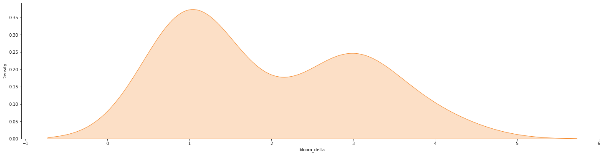
    


```python
fig,axes=plt.subplots(figsize=(25, 6))
sns.despine()
sns.boxplot(x='bloom_delta', 
            data=df_mono,
            palette='YlOrBr'
            )
```


    <AxesSubplot:xlabel='bloom_delta'>


    
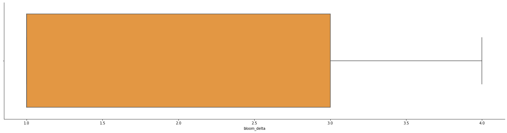
    


```python
df['bloom_delta'].describe()
```


    count    108.000000
    mean       1.675926
    std        1.142458
    min        0.000000
    25%        1.000000
    50%        1.000000
    75%        2.250000
    max        5.000000
    Name: bloom_delta, dtype: float64


#### The values are arranged in a bimodal distribution with a median of one month and a second peak for 3 month intervals.  Outliers are not present. The IQR is from ranges from 1 to 3 month intervals.  It is also worth noting that the first and second quartile have identical values.


```python
print('Count of bloom deltas')
df_mono['bloom_delta'].value_counts()
```

    Count of bloom deltas


    1.0    13
    3.0     8
    4.0     2
    2.0     2
    Name: bloom_delta, dtype: int64


# Conclusion and recommended future projects
### This was an entertaining dataset to explore however, limitations encountered during this project were significant.  This data should not be used for statistical modeling or to make business decisions.  Data integrity issues were noted several times during the course of the project; data entry errors were discovered frequently.  The dataset consisted of a low number of observations and features.  According to the Flora of North America Association there are over 20,000 species of plants on the continent; this dataset lists 208 species.  Some of features were ambiguous and the dataset lacked quantitative measurements of any kind. 

### For a recommended future project, one should utilize credible data sources from trustworthy institutions and compile a dataset that is rich in both quantitative and qualitative features.  It would be interesting to examine a similar dataset that included more features such as each species' geographic region, additional plant characteristics, bee species, honey production quantities and so on.   
